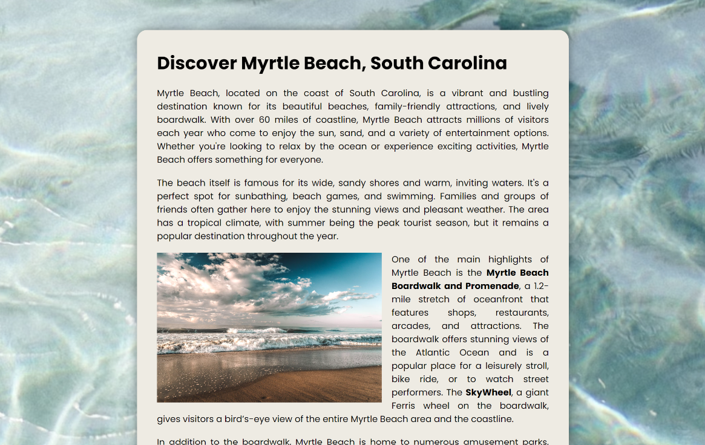

# Discover Myrtle Beach - Interactive Travel Guide

A visually immersive travel guide showcasing the beauty and attractions of Myrtle Beach, South Carolina. This project highlights the coastal environment, popular attractions, and seasonal events in Myrtle Beach, designed to inspire travel and exploration.

## Description

This project offers an interactive web experience that highlights the best aspects of Myrtle Beach, South Carolina, as a travel destination. The content is divided into sections, each featuring different topics such as beaches, attractions, environment, and events. Images and text are dynamically revealed as the user scrolls through the page, with smooth animations that create an engaging and modern experience.

The guide includes information about Myrtle Beach’s top attractions, such as the Myrtle Beach Boardwalk, the SkyWheel, and local events like the Myrtle Beach Marathon. It also addresses environmental concerns such as wildlife protection and coastal sustainability. The goal of this project is to inspire travel while promoting responsible tourism practices.

## Features

- Scrolling-triggered animations to reveal images as they come into view.
- Dynamic layout with smooth transitions for images and text.
- Interactive content sections for attractions, events, environment, and more.
- Images transition in based on user scrolling for a more engaging experience.
- Built with plain HTML, CSS (with custom properties and transitions), and JavaScript.

## Technologies Used

- HTML
- CSS
- JavaScript

## How to Run

1. Clone the repository to your local machine.
2. Open `index.html` in your preferred web browser.
3. Alternatively, you can view the live project on GitHub Pages: [Slide in on Scroll on GitHub Pages](https://deannamandarino.github.io/slide-in-on-scroll/).

## Acknowledgments

This project was completed as part of the JavaScript30 course. Special thanks to Wes Bos for the excellent resources and guidance throughout the course.